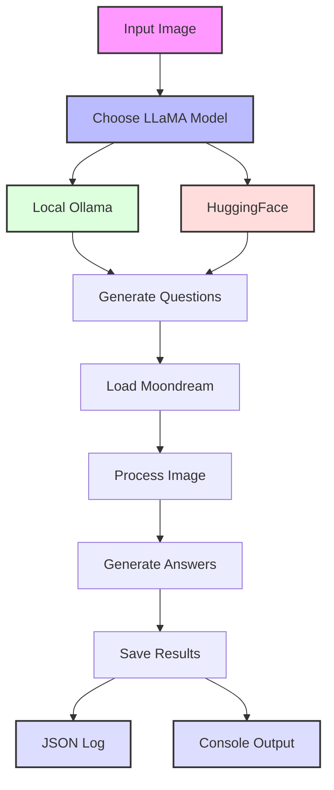
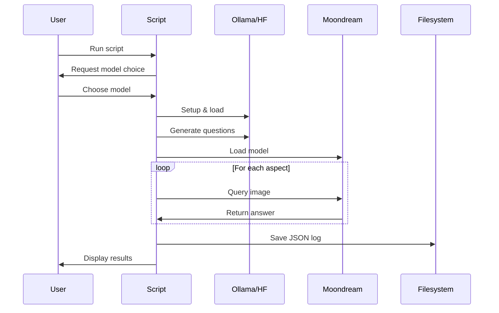

# Image Classification with Moondream and LLaMA

> **⚠️ IMPORTANT:** This project currently uses Moondream 2B (2025-01-09 release) via the Hugging Face Transformers library. We will migrate to the official Moondream client libraries once they become available for this version.
>
> **⚠️ NOTE:** You can choose between two LLaMA options:
> 1. Local Ollama LLaMA (Recommended, no approval needed)
> 2. HuggingFace LLaMA (Requires model access approval)
>
> **⚠️ AUTHENTICATION:** When using HuggingFace authentication, make sure to use a token with "WRITE" permission, not "FINEGRAINED" permission. If you encounter authorization issues despite having model access, generate a new token with "WRITE" permission.

## Table of Contents
- [Overview](#overview)
- [Process Flow](#process-flow)
- [Sample Output](#sample-output)
- [Features](#features)
- [Prerequisites](#prerequisites)
- [Installation](#installation)
- [Usage](#usage)
  - [Command-Line Options](#command-line-options)
  - [Examples](#examples)
- [Output](#output)
- [Troubleshooting](#troubleshooting)
- [Performance Notes](#performance-notes)
- [Dependencies](#dependencies)
- [Model Details](#model-details)
- [License](#license)

## Overview
This project automatically analyzes images using AI to classify multiple aspects simultaneously. It combines LLaMA for intelligent question formulation and Moondream for visual analysis, providing detailed insights about various aspects of images.

## Process Flow





## Sample Output
```
Processing: park.jpg
======================================================================
Final Classification Results:
------------------------------
Aspect: grass color
Result: Green
------------------------------
Aspect: time of day
Result: Afternoon
------------------------------
Aspect: number of people, if any
Result: 0
------------------------------
Aspect: weather conditions
Result: Sunny
------------------------------
Aspect: main activity
Result: Walking
------------------------------
... [and many more aspects]
```

## Features
- **Multi-Aspect Classification**:
  - Extensive list of aspects to analyze:
    1. Basic scene elements (grass, time, people, weather)
    2. Path characteristics (condition, curvature)
    3. Tree analysis (density, arrangement, foliage)
    4. Environmental factors (shadows, terrain, structures)
    5. Atmospheric conditions (sky, season, lighting)
    6. Landscape features (ground cover, maintenance)

- **Dual LLaMA Options**:
  - Local Ollama LLaMA (recommended)
    - No approval needed
    - Easy setup
    - Optimized prompts
  - HuggingFace LLaMA
    - Higher accuracy
    - Requires model access

- **Intelligent Question Generation**:
  - Smart retry mechanism for invalid responses
  - Context-aware question formatting
  - Optimized for concise answers

- **Comprehensive Logging**:
  - Detailed JSON logs for each run
  - Tracks all question generation attempts
  - Records final results
  - Timestamps for analysis

- **Efficient Processing**:
  - Batch processing of multiple images
  - Smart memory management
  - GPU optimization
  - Automatic cleanup

- **Flexible Input Handling**:
  - Supports multiple image formats
  - Processes entire directories
  - Error handling for unsupported files

## Prerequisites
1. Python 3.8 or later
2. CUDA-capable GPU (8GB+ VRAM recommended)
3. For HuggingFace option: Account with approved access to Meta's LLaMA model
4. For Ollama option: None (automatically installed if needed)

## Installation
1. Clone the repository:
   ```bash
   git clone [repository-url]
   cd classify-anything
   ```

2. Create and activate virtual environment:
   ```bash
   python -m venv venv
   source venv/bin/activate  # Linux/macOS
   # or
   .\venv\Scripts\activate  # Windows
   ```

### System Dependencies
```bash
# Linux/Ubuntu
sudo apt-get update
sudo apt-get install libvips libvips-dev

# macOS with Homebrew
brew install vips

# Windows
# Download and install libvips from https://github.com/libvips/build-win64/releases
```

3. Install dependencies:
   ```bash
   pip install -r requirements.txt
   ```

## Usage
1. Place your images in the `inputs` folder
2. Run the script:
   ```bash
   python classify.py
   ```
3. Choose your preferred LLaMA model:
   - Option 1: Local Ollama (recommended)
   - Option 2: HuggingFace (requires authentication)

4. For HuggingFace option, authenticate:
   ```bash
   huggingface-cli login
   # or
   python classify.py --token YOUR_TOKEN
   ```

### Command-Line Options
```bash
--token     Optional: HuggingFace token for authentication
```

### Examples
```bash
# Process all images in inputs directory
python classify.py

# [Future enhancement: Add examples with custom options]
```

## Output
The script provides:
1. **Console Output**:
   - Processing status for each image
   - Generated questions
   - Classification results
   - Error messages (if any)

2. **Results Format**:
   - Aspect-by-aspect breakdown
   - Concise, clear answers
   - Structured presentation

## Troubleshooting
1. CUDA/GPU Issues:
   - Ensure CUDA is properly installed
   - Verify GPU has sufficient VRAM (8GB+ recommended)
   - Close other GPU-intensive applications

2. Memory Issues:
   - Process fewer images at once
   - Clear GPU cache between runs
   - Monitor system resources

3. Model Loading Issues:
   - Verify HuggingFace authentication
   - Check LLaMA model access status
   - Update transformers library
   - **Important**: Use a HuggingFace token with "WRITE" permission, not "FINEGRAINED" permission
   - If you encounter authorization issues despite having model access, try generating a new token with "WRITE" permission

4. Ollama Issues:
   - Ensure Ollama is properly installed
   - Check if Ollama service is running
   - Verify LLaMA model is pulled
   - Monitor Ollama logs for errors

5. Logging Issues:
   - Check write permissions for logs directory
   - Ensure sufficient disk space
   - Verify JSON format in log files

## Performance Notes
- Processing time depends on:
  - Number of images
  - Number of aspects to classify
  - GPU memory and speed

- Memory Usage:
  - Moondream model: ~4GB VRAM
  - LLaMA model: ~6GB VRAM
  - Efficient memory management between model loads

## Dependencies
Required Python packages:
- transformers
- torch
- Pillow (PIL)
- opencv-python (cv2)
- huggingface-hub
- accelerate

All dependencies can be installed via:
```bash
pip install -r requirements.txt
```

## Model Details
- **Question Generation**: Meta's LLaMA 3.2 3B Instruct
  - Generates natural language questions
  - Optimized for clear, focused queries

- **Image Analysis**: Moondream 2B (2025-01-09 release)
  - Specialized for detailed image understanding
  - Provides concise, accurate answers

## License
This project is licensed under the MIT License. 